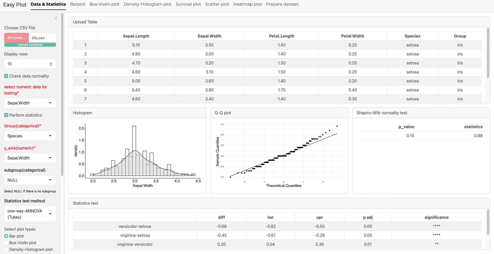

# EasyPlot

**[EasyPlot](https://k78x0p-xiaoke-xu.shinyapps.io/deployment/)** is a general-purpose R Shiny application for interactive data visualization. It supports a wide variety of plot types and allows flexible parameter control for dynamic exploration of datasets.

 <!-- Optional: include a UI image -->

---

## 🚀 Features

- Interactive plotting with customizable options
- Support for multiple plot types (e.g., bar plots, box/violin plots, grouped bar/box/violin plots, survival plots, histogram/density plots, scatter plots, heatmaps)
- Support multiple statistics methods (e.g. t-test, one-way-ANNOVA with Tukey post-hoc test, Mann-Whitney U test, etc.)
- User-friendly interface with real-time updates and downloading options for high-res figures and statistics results
- Dynamic dataset upload and reset functionality
- Theme support via `bslib`

---

## 🌐 Live App

You can access the deployed app here: [EasyPlot](https://k78x0p-xiaoke-xu.shinyapps.io/deployment/)  

---

## 📁 Directory Structure
EasyPlot<br/>
├── ui.R<br/>
├── server.R<br/>
├── functions.R<br/>
├── DESCRIPTION<br/>
└── README.md<br/>

---

## 🛠️ Installation (For Local Run)

1. Clone the repository:

```bash
git clone https://github.com/macrophage666/EasyPlot
cd EasyPlot
```
---

2. Open R and install dependencies:
```r
install.packages("renv")
renv::restore()
```
3. Run the app:
```r
shiny::runApp()
```
---

### 🧪 Development Notes

- Uses ```bslib::page_navbar()``` for multi-tab layout and theming
- Dynamic UI reactivity based on uploaded data
- Reset button for switching the datasets

